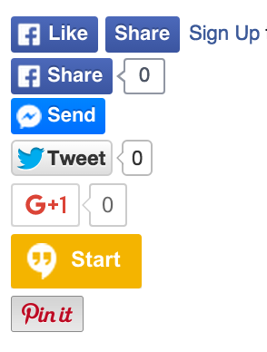

## react-social-buttons

[](https://badge.fury.io/js/detectie)

social buttons component for react, includes google, facebook, twitter, pinterest and more

``` js
import { FacebookLikeButton, TwitterButton } from 'react-social-buttons';

class App {
  render {
    let url = "https://github.com";

    return (
      <div>
        <FacebookLikeButton url={url} />
        <TwitterButton url={url} />
      </div>
    );
  }
}
```
## Examples



**simple example**

    npm run start-simple

- then open `http://127.0.0.1:5000`

**react router example**

    npm run start-rr

- then open `http://127.0.0.1:5000`

- there is a home route which lists the books, and each book has all the social buttons

## Development

**build src to lib**

    npm run build

**run tests**

    npm install
    npm test

**to run tests in the browser...**

`npm install webpack -g`

compile test.js to a bundle with webpack

	webpack ./test/test.js ./test/test-bundle.js

open test.html to view the tests in the browser

## License

[MIT](http://isekivacenz.mit-license.org/)